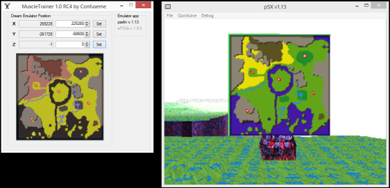
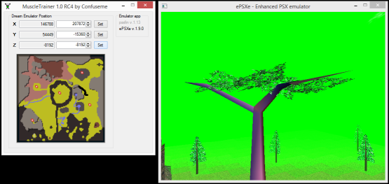

# MuscleTrainer by Confuseme

## Download
Latest versions (recommended)
https://github.com/Confuseme/MuscleTrainer/releases

|Old release versions|
|----------------|
|[MuscleTrainer 1.0](Old%20releases/MuscleTrainer-1.0.zip)|

|Old pre-release versions|
|--------------------|
|[MuscleTrainer 1.1 Release Candidate 4](Old%20releases/MuscleTrainer-1.1RC4.zip)|
|[MuscleTrainer 1.1 Release Candidate 3](Old%20releases/MuscleTrainer-1.1RC3.zip)|
|[MuscleTrainer 1.1 Release Candidate 2](Old%20releases/MuscleTrainer-1.1RC2.zip)|
|[MuscleTrainer 1.1 Release Candidate 1](Old%20releases/MuscleTrainer-1.1RC1.zip)|
|[MuscleTrainer 1.0 Release Candidate 5](Old%20releases/MuscleTrainer-1.0RC5.zip)|
|[MuscleTrainer 1.0 Release Candidate 4](Old%20releases/MuscleTrainer-1.0RC4.zip)|
|[MuscleTrainer 1.0 Release Candidate 3](Old%20releases/MuscleTrainer-1.0RC3.zip)|
|[MuscleTrainer 1.0 Release Candidate 2](Old%20releases/MuscleTrainer-1.0RC2.zip)|
|[MuscleTrainer 1.0 Release Candidate 1](Old%20releases/MuscleTrainer-1.0RC1.zip)|

Depending on your security settings and operating system, you may receive this warning. It is expected since this is not widespread software.

The program is not signed by a trusted publisher since it is a small scale hobbyist program, so you may receive warnings about that as well.

## Compatibility
MuscleTrainer 1.0 supports ePSXe v.1.9.0 and psxfin v.1.13. The latest release of MuscleTrainer 1.1 supports ePSXe v.2.0.5 instead of v.1.9.0. Do you run another emulator and want it to be supported in a future release? Please write a comment in the forum.

## Installation
Extract and run the executable file inside the .zip file. MuscleTrainer can be started at any time, before or after the emulator is started. The trainer will auto-detect any running compatible emulators. The image file does not have to be mounted when starting.

## Changing position
MuscleTrainer will continuously try to connect to any running emulators. Once connected, your emulator will be appear as black in the Emulator app list. The left column values will display the continuously updated values read from the game memory. The right column can be used to set a value of your choice. X, Y and Z refer to the length, width and height 3D coordinates used by the game to determine where on the map you are. Once done, push the Set button next to the box to set that value.

## The map
When wandering around in The Natural World, your path will be painted on the map.

## Contact
Questions? Write a comment at the Dream emulator MuscleTrainer [forum](http://dreamemulator.wikia.com/wiki/Thread:5283). No login required.

## Contribute
There are currently few screenshots and Youtube™ demos available so please upload some to your website of choice. Links to this page would help MuscleTrainer appear in search engines. At the moment, it is hard to find using Google™.

## Develop
* Install Visual Studio 2017 Community. Do not add any components.
* Clone the Git repository.
* Open the solution in the cloned repository.
* Install any extra components, such as Windows Forms, if asked.
* Open the solution again.
* Download the targeting pack for .Net Framework v2.0 if asked. Can be installed by following this guide https://docs.microsoft.com/sv-se/dotnet/framework/install/dotnet-35-windows-10
* Restart Visual Studio and open the solution again.
